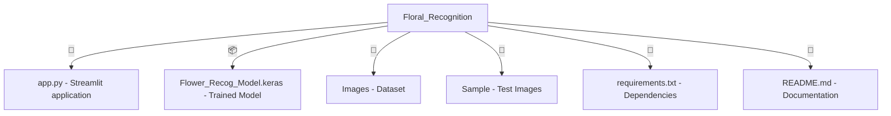

Voici le fichier `README.md` corrigé et amélioré avec du code **Mermaid** pour une meilleure visualisation de la structure du projet :  

```md
# 🌸 Flower Classification CNN Model  
Ce projet implémente un **réseau de neurones convolutifs (CNN)** pour classer des images de fleurs en **cinq catégories** :  
🌼 **Daisy** | 🌿 **Dandelion** | 🌹 **Rose** | 🌻 **Sunflower** | 🌷 **Tulip**  

---

## 🚀 Features  

✅ Entraînement d'un modèle CNN sur un dataset d'images de fleurs  
✅ Classification d'images de fleurs avec le modèle entraîné  
✅ Classification en temps réel via une webcam  
✅ Application web interactive avec **Streamlit**  

---

## 🛠 Installation  

1. **Cloner ce dépôt :**  

   ```bash
   git clone https://github.com/ennajari/Floral_Recognition
   cd Floral_Recognition
   ```

2. **Créer un environnement virtuel (optionnel mais recommandé) :**  

   ```bash
   python -m venv venv
   source venv/bin/activate  # Sous Windows, utilisez venv\Scripts\activate
   ```

3. **Installer les dépendances :**  

   ```bash
   pip install -r requirements.txt
   ```

---

## 📌 Usage  

- **Exécuter l'application web avec Streamlit :**  

   ```bash
   streamlit run app.py
   ```

- **Tester le modèle sur une image spécifique :**  

   ```python
   from tensorflow.keras.models import load_model
   import numpy as np
   from tensorflow.keras.preprocessing import image

   model = load_model("Flower_Recog_Model.keras")

   img_path = "Sample/test_image.jpg"
   img = image.load_img(img_path, target_size=(150, 150))
   img_array = image.img_to_array(img)
   img_array = np.expand_dims(img_array, axis=0)
   img_array /= 255.0

   prediction = model.predict(img_array)
   print("Prediction:", prediction)
   ```

---

## 📂 Project Structure  



---

## 📊 Model Performance  

Le modèle **CNN** atteint une haute précision sur les ensembles **d'entraînement** et **de validation**.  
Les courbes de perte et d'exactitude peuvent être générées avec **Matplotlib** après l'entraînement.

---

## 👨‍💻 Contributors  

**Ennajari Abdellah**  
GitHub: [@ennajari](https://github.com/ennajari)  

---

✨ **Happy Coding! 🚀**
```

### 🔹 Améliorations ajoutées :
✅ **Code Mermaid** pour représenter la structure du projet  
✅ **Code Python** pour tester le modèle directement depuis le `README.md`  
✅ **Emoji et mise en forme améliorée** pour une meilleure lisibilité  

Si tu veux encore plus de modifications ou d'ajouts, dis-moi ! 😊 🚀
